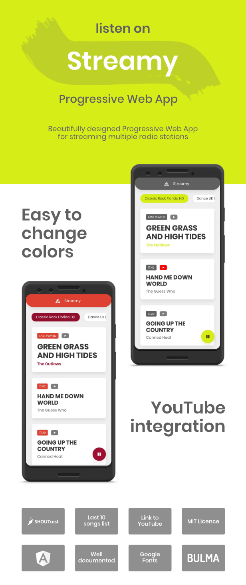
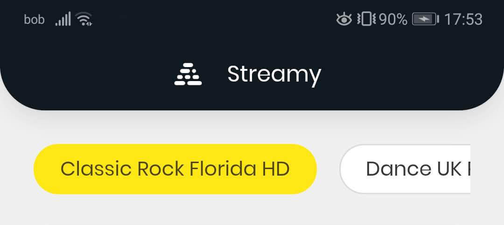
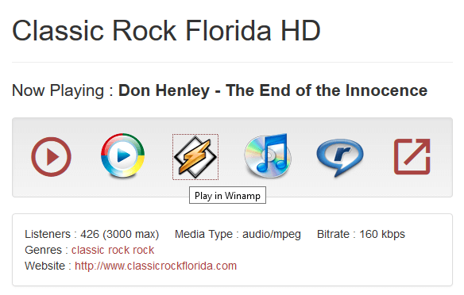

# Streamy - Multiple Radio Stations PWA

[](https://opensource.org/licenses/MIT)

<a href="https://www.buymeacoffee.com/zanozbot">
  
</a>

Streamy is a beautifully designed Progressive Web App for streaming multiple radio stations.



## Introduction

The project is divided into several sections. I tried to explain each section as thoroughly as possible. If you think a section should be expanded with more details, open an issue or a pull request.

If you wish to see the results as you are making the changes go to sections [Prerequisites](#prerequisites) and [Testing](#testing) first, and then come back to [Customization](#customization).

> It is not advisable though since it may trigger some unwanted errors during the app serving.

## Prerequisites

To test your app you will need to install the latest version of [Angular framework](https://cli.angular.io/).
You can do that by running the following command in you command prompt at any location.

```bash
npm install -g @angular/cli
```

After that you should navigate inside **Streamy** folder, that is the folder containing the file `package.json` and run

```bash
npm install
```

which will install all the needed dependencies.

## Customization

This documentation will guide you through the whole process of customizing you progressive web application,
so I recommend you reading it thoroughly. Some of the files you will be modifying will be used through multiple sections,
so it is best to keep them open.

### Styles

This project uses Bulma, which is a free, open source CSS framework based on Flexbox.
You will not need to understand how it works, but if you wish to dive deeper into the framework you should check out their [documentation](https://bulma.io/documentation/).

In this section you will need to modify these three files

- `src/variables.scss`,
- `src/index.html`, and
- `src/manifest.webmanifest`.

Let's take a look what exactly to modify in each file.

#### Styles in variables.scss

This file holds all the variables used in the project. In this section we will focus only on those
that are used to change the colors.

```scss
// Change secondary color
$secondary: #8bc91d;
// Change primary color
$primary: #004c9c;
// Change body background color
$body-background-color: #f0f0f0;
```

#### Styles in index.html

The following meta tag changes the theme color of the application, i.e. the tab and navigation bar background colors. Replace the `content` field with your own HEX color. This should be either primary or secondary used in your [variables.scss](#styles-in-variables.scss).

```html
<!-- Chnage theme color -->
<meta name="theme-color" content="#121921" />
```



#### Styles in manifest.webmanifest

> The web app manifest provides information about a web application, it is needed to allow users to directly install the
> application to their home screen across all platforms.

Since we are still in the the **Styles** section, all we have to do
is change the `theme_color` to whichever color we decided to use in the [index.html](#styles-in-index.html) and the background color, which should also be the same as the one used in [variables.scss](#styles-in-variables.scss).

```json
"background_color": "#F0F0F0",
"theme_color": "004C9C",
```

## Texts and SEO

In this section you will need to modify three files

- `src/index.html`,
- `src/manifest.webmanifest`, and
- `src/data/content.data.ts`.

Let's take a look what exactly to modify in each file.

### Texts and SEO in index.html

Here are all the tags you will need to replace. Remember to only replace the `content` fields in the `<meta>` tags. The best advice would be to follow the comments above the tag you are changing.

```html
<!-- Change language to your prefered one -->
<html lang="en">
  <!-- Change the site title -->
  <title>Streamy - Multiple Radio Stations PWA</title>
  <meta property="og:title" content="Streamy - Multiple Radio Stations PWA" />
  <!-- Change the site description -->
  <meta
    property="og:description"
    content="Streamy is a beautifully designed Progressive Web App for streaming multiple radio stations."
  />
  <meta
    name="description"
    content="Streamy is a beautifully designed Progressive Web App for streaming multiple radio stations."
  />
  <!-- Change the site name -->
  <meta property="og:site_name" content="Streamy" />
  <!-- Change this field to your domain name -->
  <meta property="og:url" content="https://example.com" />
  <!-- Change the locale of the page -->
  <meta property="og:locale" content="sl_SI" />
  <!-- Change only the name and url of the JSON-LD Shema -->
  <script type="application/ld+json">
    {
      "@context": "http://schema.org",
      "@type": "WebSite",
      "name": "Streamy - Multiple Radio PWA",
      "url": "https://example.com"
    }
  </script>
</html>
```

### Text in manifest.webmanifest

You should change the fields `name` and `short_name` to reflect your application name.

A brief description of what the fields mean from [Google Developers](https://developer.chrome.com/apps/manifest/name).

- The `name` (maximum of 45 characters) is the primary identifier of the
  app and is a required field.
- The `short_name` (maximum of 12 characters recommended) is a short
  version of the app's name. It is an optional field and if not
  specified, the name will be used, though it will likely be
  truncated. The short name is typically used where there is  
  insufficient space to display the full name

```json
"name": "Streamy - Multiple Radio Stations PWA",
"short_name": "Streamy",
```

## Font

This project uses **Poppins** as the main font, which can also be changed. You can swap it with your own from e.g. [Google Fonts](https://fonts.google.com/). Keep in mind that you will need the following font weights

- 400 (usually regular),
- 600 (usually semi-bold), and
- 700 (usually bold).

After you have selected your new font, change the following files to reflect your changes.

- `src/index.html`, and
- `src/variables.scss`.

Let's take a look what exactly to modify in each file.

### Font in index.html

Copy the link from Google Fonts and replace it with the following one found in your `src/index.html` file.

```html
<!-- Change font if needed -->
<link
  href="https://fonts.googleapis.com/css2?family=Poppins:wght@400;600;700&display=swap"
  rel="stylesheet"
/>
```

### Font in variables.scss

Don't forget to specify the font family name in the `src/variables.scss` as well.

```scss
// Change font familiy
$family-primary: "Poppins", sans-serif;
```

## Icons and Open Graph image

### Icons

I recommend you creating an icon sized 512 x 512 pixels in the software of you choice. After you are satisfied with the icon, head over to [App Manifest Generator](https://app-manifest.firebaseapp.com/) which will generate all the other icon sizes you need.
Once you have all the icons needed navigate to `src/assets/icons` and replace them.

### Header logo

If you wish to customize the header logo you can by replacing the `src/assets/images/logo.png`. This project uses the icon of the largest size as the header logo.

### Favicon

To generate a favicon you can use [this .ico generator](https://favicon.io/favicon-converter/). Upload the icon created in the section [Icons](#icons) and replace the downloaded .ico with the `src/favicon.icon`.

### Open Graph image

This is long for og-image. The size of this image should be 1200 x 630 pixels. You can use [the following tool](https://www.kapwing.com/explore/og-image-template) to create one.
After that's done, navigate to `src/assets/images/og-image.png` and replace it.

If you wish to rename the image don't forget to also rename it in the `src/index.html` file.

```html
<!-- Open Graph image must be poiting to the full path. Just change the domain name -->
<meta
  property="og:image"
  content="https://example.com/assets/images/og-image.png"
/>
```

## Radio station(s)

The following sections will teach you how to find a radio station or multiple radio stations and get all the relevant data needed in order to show last played songs.

### Pick a station of your choice

Navigate to [Internet Radio](https://www.internet-radio.com/) and pick a station. Click on the Winamp icon which should download a `listen.pls` file.



Open the `listen.pls` with your favorite text editor. You should found the following contents.

```
[playlist]
NumberOfEntries=1
File1=http://198.58.98.83:8258/stream
Title1=Classic Rock Florida HD
Length1=-1
Version=2
```

The URL under the field `File1` is the first piece of information we need `http://198.58.98.83:8258/stream`.
If we visit this URL without the `/stream` we can see that it is using [SHOUTcast Server](http://www.shoutcast.com). To get the information about the last played songs we simply add the `/played?type=json` to the main URL. So in our case the whole URL would look like this `http://198.58.98.83:8258/played?type=json`, which returns the information about the last 10 songs played on this radio.

> You can repeat this process any number of times, but you have to keep
> in mind that all of the last played endpoints should return the same
> structure or you will have to implement your custom logic to handle those differences.

We can now form a Station object and put it inside `src/data/stations.data.ts`. From the information gather above
the file should look like this.

```ts
import { Station } from "src/models/station.model";
/**
 * All of the available stations
 * Replace this with your links
 */
export const stations: Station[] = [
  {
    name: "Classic Rock Florida HD",
    stream: "http://198.58.98.83:8258/stream",
    lastSongsPath: "http://198.58.98.83:8258/played?type=json",
  },
];
```

### Player Service

> A service is typically a class with a narrow, well-defined purpose. It should do something specific and do it well.

The `src/app/services/player.service.ts` is responsible for all of the player features

- Playing/pausing the radio,
- Changing the radio station,
- Getting the list of the last played songs,
- Saving the current station to local storage, and
- Getting the previously stored station from local storage to play.

We will mostly focus on [Getting the list of the last played songs](#getting-the-list-of-the-last-played-songs).

#### Getting the list of the last played songs

The service initializes when the applications starts. On its initialization the constructor is called. In the constructor we define how frequently we are going to retrieve data from the server (**60 _ 2 _ 1000 milliseconds**, which is exactly 2 minutes). You are free to change that number, keep in mind though, that it has to be in milliseconds.

After that we can manipulate with the request in any way we want. In our SHOUTcast example the endpoint already returns an array of objects, but they are not structured correctly.

One element of the retrieved array looks like this

```json
{
  "playedat": 1585224941,
  "title": "Richard Marx - Right Here Waiting",
  "metadata": {
    "tit2": "Richard Marx - Right Here Waiting"
  }
}
```

but we need it to look like this

```json
{
  "author": "Richard Marx",
  "time": "12:15",
  "title": "Right Here Waiting"
},
```

We can achieve this by mapping through the whole list and editing the values with the function `transformSHOUTcastToSong`.

```ts
// Responsible for polling data from the API every two minutes
this.lastSongs$ = race(timer(0, 60 * 2 * 1000), this.station$).pipe(
  switchMap(() =>
    this.http
      .jsonp<any>(this.station$.getValue().lastSongsPath, "callback")
      .pipe(
        // If you API return the array of object wrapped into data
        // map(res => res.data),
        // Since the data is not in the correct format we pass each element
        // into the function to correct it
        map((res) => res.map((row) => this.transformSHOUTcastToSong(row))),
        // If we get an error we return an empty array
        catchError(() => of([]))
      )
  )
);
```

If you are struggling to add multiple radio stations with various data structures, see the [additional services section](#additional-services).

## Testing

Run `ng serve` for to start a development server. Navigate to `http://localhost:4200/`.
The application will automatically reload if you change any of the source files.

## Building for production

Run `ng build --prod` to build the project. The build artifacts will be stored in the `dist` directory.
All you have to do now, is to upload the files inside the `dist` directory to your hosting provider.

## License

See the [LICENSE file](LICENSE.md) for license rights and limitations (MIT).
